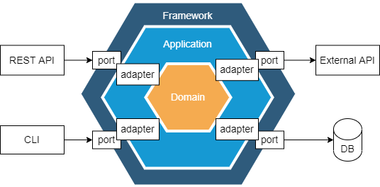
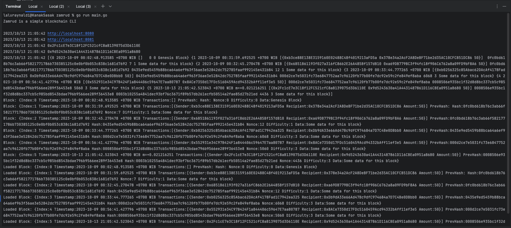

# Zamrud Chain

A simple blockchain implementation using Go and the hexagonal architecture pattern. this project is under development and will be update soon.

## Table of Contents

- [Introduction](#introduction)
- [Features](#features)
- [Prerequisites](#prerequisites)
- [Installation](#installation)


## Introduction

Zamrud Chain is a minimalist blockchain prototype implemented using Go. It leverages the hexagonal architecture (also known as the Ports & Adapters pattern) to create a clean separation of concerns, ensuring that the core logic of our blockchain remains independent of external factors.




## Features

- Basic blockchain operations (creation of new blocks, validation, mining(PoW) ,etc.)
- Hexagonal architecture for clean code separation
- Lightweight and fast

## Prerequisites

- Go (version 1.20 or later)
- Basic knowledge of blockchain principles
- Familiarity with the hexagonal architecture pattern (optional)

## Installation

1. Clone the repository:

   ```bash
   git clone https://github.com/KanakSasak/zamrud-chain.git

